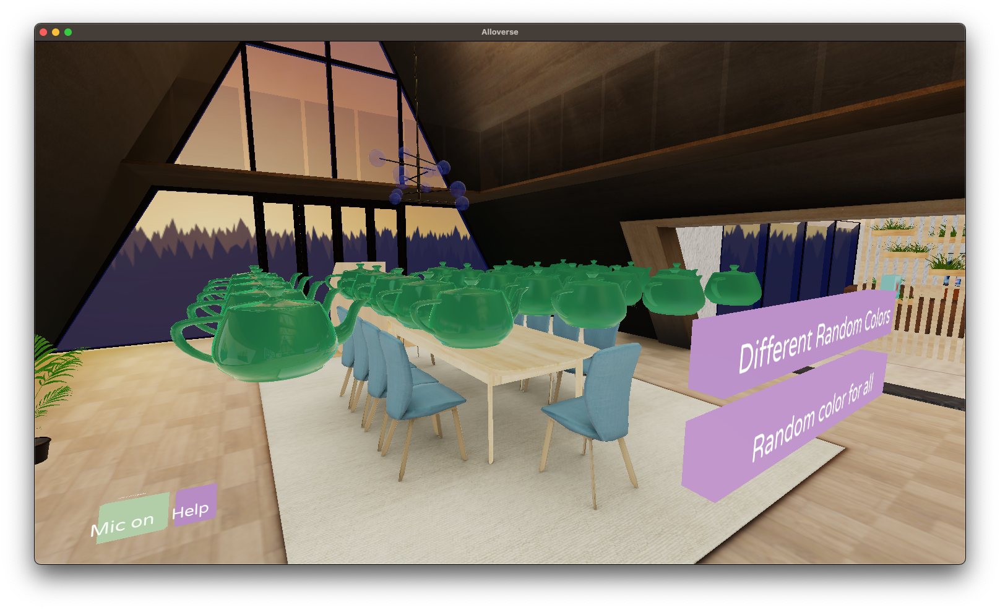

# Material Teapots

This is a demo application of the two material properties "metalness" and "roughness"

Metalness represents how much the material reflects light (1), or absorbs it (0)

Roughness represents how much the material scatters light in random directions (1), or reflects it perfectly (0)

The app show a grid of teapots. The left- and front-most ones has a roughness and metallness of 0. 
Roughness increases to the right and Metallness increases to the back

```
^ metallness
|
|
|
|
|______________> roughness
```

Pressing the button randomizes the color of all teapots. 

If you are on desktop, do try this with reflections enabled in the graphics options!



## Developing

Application sources are in `lua/`.

To start the app and connect it to an Alloplace for testing, run

```
./allo/assist run alloplace://nevyn.places.alloverse.com
```

## Documentation

We're still working on setting up a comprehensive documentation web site. Some initial documentation
is provided in your `lua/main.lua`.

The implementation of the UI library has documentation inline which you can use while we're
working on the docs website. Navigate to `allo/deps/alloui/lua/alloui` and have a look at the various
lua files in there, and in particular the various UI elements under `views`. Some various views include:

* Surface, a flat surface to put stuff on
* Label, for displaying text
* Button, for clicking on
* Navstack, for drilling into nested data
